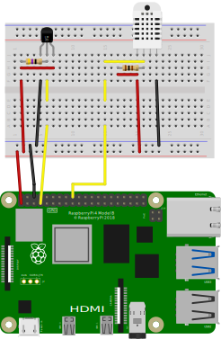

# brewingthing

Thing to check on brewing session temperatures

Comprised by a raspberry pi with a DHT22 and a DS18B20 sensors connected to the raspberry GPIO board, we intend to check on temperatures related to brewing sessions. Temperature of the wort, and temperature and humidity of the environment, and show up the information in a browser through Flask.

## How to

Create a virtual environment and install dependencies

```bash
python -m venv venv
source venv/bin/activate
pip install -r requirements.txt
```

Copy the unit file

```bash
cd brewingthing
cp unit_files/brewingthing.service /etc/systemd/system/
sudo systemctl enable brewingthing --now
```

Now you should be able to access the raspberry pi IP address or domain name over port 8080

## Data log

You can add a new service that would record readings each half an hour into a json file at `/home/pi/sessions/current.json`

```bash
cd brewingthing
cp unit_files/brewinglogging.service /etc/systemd/system/
sudo systemctl enable brewinglogging --now
```

Check on `session_example.json` for an example of the log file.


##  Hardware Implementation


